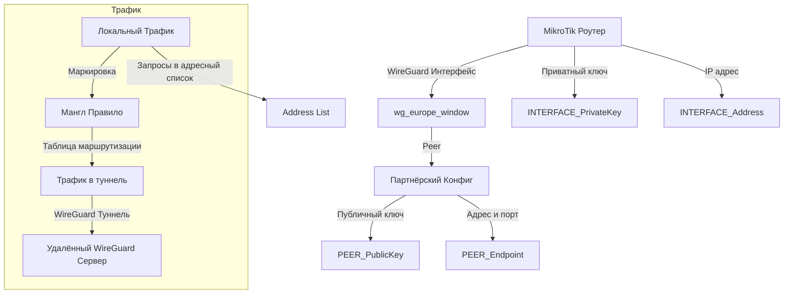

## Хочу роутинг на роутере! Шобы было заебись!

Берём за данность, что у нас уже есть сконфигурированный Wireguard сервер и рабочий конфиг для него, который заблаговременно был проверен перед тем, как пытаться пихать его на свой роутер. 



## Необходимые данные из конфига


1. **INTERFACE_PrivateKey** - приватный ключ пользователя, обратная сторона которого лежит на сервер.
2. **INTERFACE_Address** - адрес пользователя присвоенный ему внутри WG сети.
3. **PEER_PublicKey** - публичный ключ сервера к которому мы подключаемся.
4. **PEER_Endpoint** - адрес и порт WG сервера. 

## Настройка роутера

В первую очередь нам необходимо создать wireguard интерфейс. Порт не имеет значения, но приватный ключ должен быть полученным ранее значением из конфига.

```bash
/interface wireguard add listen-port=%any% mtu=1420 name=wg_europe_window private-key="%INTERFACE_PrivateKey%"
```

Далее мы создаём peer для этого интерфейсы, в котором указываем адрес, порт и публичный ключ нашего WG сервера.

```bash
/interface wireguard peers add interface=europe_window allowed-address=0.0.0.0/0 endpoint-address=%PEER_Endpoint% endpoint-port=%PPEER_Endpoint_Port% public-key="%PEER_PublicKey"
```

Теперь необходимо разрешить выход в интернет для данного интерфейса, для этого нужно добавить его в **interface list** с названием **WAN.**

```bash
/interface list member add list=WAN interface=europe_window
```

Полученный из конфига адрес нужно добавить в адреса роутера.

```bash
/ip address add address=%INTERFACE_Address%/32 interface=europe_window
```

Создаём таблицу маршрутизации, в которую будут попадать адреса которые мы захотим направить в туннель.

```bash
/routing table add name=to-europe_window fib
```

Сделаем mangle правило которое будет отлавливать все запросы в определённом **address list** и направлять их в ранее созданную таблицу маршрутизации. На месте 192.168.88.0/24 должна быть домашняя подсеть.

```bash
/ip firewall mangle add action=mark-routing chain=prerouting dst-address-list=europe_window dst-address-type=!local new-routing-mark=to-europe_window passthrough=yes src-address=192.168.88.0/24 comment="WG FREEDOM"
```

На данном этапе мы уже можем вылавливать нужные нам запросы, осталось только направить их в нужное русло через **route**. Адреса обязательно должны быть нулями и обязательно нужно указать таблицу маршрутизации, иначе рискуешь положить себе сеть

```bash
/ip route add disabled=no distance=1 dst-address=0.0.0.0/0 gateway=europe_window routing-table=to-europe_window suppress-hw-offload=no comment="WG FREEDOM"
```

## А как добавлять адреса? 

Есть два стула

### Address list

Просто добавляешь необходимый ip/домен/подсеть в список указанный ранее во время конфигурации.

```bash
/ip firewall address-list add list=europe_window address=pornhub.com
/ip firewall address-list add list=europe_window address=175.24.0.0/16
/ip firewall address-list add list=europe_window address=82.202.191.70
```

### DNS FWD

Не так давно наконец-то довели до ума внутренний DNS и он перестал брать в рот с включенным DoH, так что от чего бы не воспользоваться благами цивилизации? В отличие от первого варианта - есть возможность указать wildcard либо по-простому галочкой, либо даже изъебнувшись через REGEX BRE.

```bash
/ip dns static add name=nnmclub.to match-subdomain=yes type=FWD address-list=europe_window forward-to=1.1.1.1
/ip dns static add regexp=".*discord[-\\.a-zA-Z0-9]*\\..*" address-list=europe_window forward-to=1.1.1.1
```

Regexp через winbox будет выглядеть чутка иначе, ибо не нужен [escape](https://forum.mikrotik.com/viewtopic.php?t=183221) `.*discord[-\.a-zA-Z0-9]*\..*`
